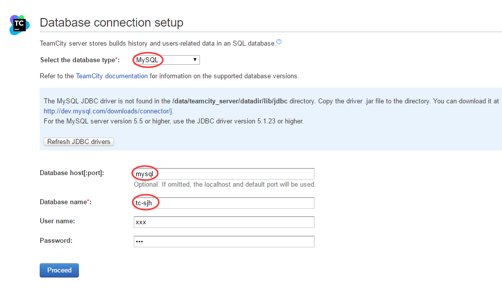

Propersoft TeamCity Server in Docker
====================================

```
$ docker-compose up -d
```

### 关于 `TEAMCITY_CONTEXT` 环境变量的说明

`docker-compose.yml` 中可以配置 `TEAMCITY_CONTEXT` 环境变量。

`entrypoint.sh` 会将 tomcat 里的 webapp 更名为这个变量的值。

为避免 TeamCity 启动时的异常情况，该环境变量的值必须设置为与 TeamCity Server 的服务器地址 URL 上下文根一致，且不能为空。

例如 TeamCity Server 的地址为 http://teamcity:8111/tc，则 `TEAMCITY_CONTEXT` 需设置为 `tc`。TeamCity Server 的地址 **不能是多级**，如不可以为 http://teamcity:8111/xxx/tc 。

### 多个数据库跑在一个MySQL实例里面实现方法

需要在原有的MySQL实例里面创建新的数据库，并且原有数据库账号要有新数据库的读写权限，在第一次访问teamcity应用服务时需填写连接新建数据库信息：**用户名、密码、MySQL host地址、新数据库名称** 即可。 

**例如：1、在原有MySQL实例里面新增tc-sjh数据库，执行：**
```
mysql -h172.18.0.6 -uxxx -pxxx -e 'CREATE DATABASE `tc-sjh` /*!40100 DEFAULT CHARACTER SET utf8mb4 COLLATE utf8mb4_unicode_ci */'
```

**2、访问teamcity应用服务填写连接数据库信息**


